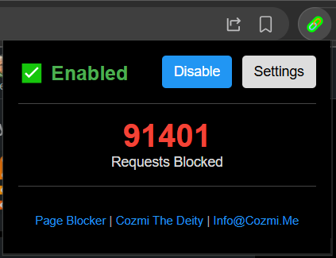

# URL Blocker - Browser Extension



A powerful Chromium-based browser extension that blocks URLs matching patterns from local and cloud-based block lists.

## Features

- **URL Interception**: Intercepts all browser requests and compares URLs against regular expression patterns
- **Enable/Disable**: Toggle blocking on/off with one click
- **Visual Status Indicators**: Toolbar icons change color to show status:
  - 🟤 **Grey** - Extension disabled
  - 🟢 **Green** - Extension enabled and idle
  - 🟡 **Yellow** - Working (processing requests)
  - 🔴 **Red** - Blocked (request was blocked)
- **Block Counter**: Tracks the number of requests blocked in the current session
- **Local Block List**: Store your own block patterns in a local plain text file
- **Cloud Sync**: Optionally sync block patterns from a remote URL
- **Pattern Support**: Use regular expressions for flexible pattern matching
- **Comment Support**: Add comments to block list files using `#` prefix

## Installation

### Step 1: Download the Extension

1. Clone or download this repository to your local machine
2. Extract the files if downloaded as a ZIP archive

### Step 2: Load the Extension in Chrome/Chromium

1. Open your Chromium-based browser (Chrome, Edge, Brave, etc.)
2. Navigate to `chrome://extensions/` (or `edge://extensions/` for Edge)
3. Enable **Developer mode** using the toggle switch in the top right corner
4. Click the **Load unpacked** button
5. Select the `Browser-Extention` folder from your downloaded files
6. The extension should now be installed and visible in your toolbar

### Step 3: Configure the Extension

1. Click the extension icon in your browser toolbar
2. Click **Settings** to open the options page
3. Configure your preferences:
   - **Cloud Sync**: Enter a URL to sync block patterns from (optional)
   - **Sync Interval**: Set how often to check for updates (default: 1 hour)
   - **Local Block List**: Add your own patterns in the text area
4. Click **Save Settings** to apply your changes

## Usage

### Toggling the Extension

- Click the extension icon in your toolbar
- Click **Enable** or **Disable** to toggle blocking

### Managing Block Lists

#### Local Block List

Edit the block patterns directly in the Settings page. Each line should contain:
- A regular expression pattern
- A comment (starting with `#`)
- Or be empty

Example:
```
# Block ads
ads\.example\.com
doubleclick\.net
```

#### Cloud Block List

1. Create a text file with your block patterns and host it on a web server
2. In the Settings page, enable Cloud Sync
3. Enter the URL to your hosted block list
4. The extension will automatically sync at the configured interval

**Note:** Cloud sync may take up to 1 hour to refresh automatically. For immediate effect after changing the block list URL, click the **Sync Now** button in the Settings page.

### Viewing Block Statistics

The popup shows the number of requests blocked in the current session. This counter resets when:
- You restart the browser
- You reload the extension

## Block List Format

The block list file format is simple:

```
# Comment line - ignored
# Add your patterns below
pattern1\.com
pattern2\.net
another.*pattern
```

Rules:
- Lines starting with `#` are comments
- Empty lines are ignored
- Each non-comment line is a regular expression pattern
- Patterns are tested against the full URL

## Regular Expression Examples

| Pattern | Matches |
|---------|---------|
| `ads\.example\.com` | `ads.example.com` |
| `\.google-analytics\.com` | Any subdomain of google-analytics.com |
| `.*\.ads\.com` | Any domain ending with .ads.com |
| `facebook\.com\/ads` | facebook.com/ads and subpaths |
| `doubleclick\.net\/.*` | Any URL on doubleclick.net |

## Default Block Patterns

The extension includes default patterns for common ad networks:
- `doubleclick.net`
- `google-analytics.com`
- `googlesyndication.com`
- `ad.network.com`

## Troubleshooting

### Extension not blocking requests

1. Make sure the extension is enabled (check the toolbar icon)
2. Verify your patterns are valid regular expressions
3. Check the browser console for errors (`Ctrl+Shift+I` to open DevTools)

### Cloud sync failing

1. Verify the URL is correct and accessible
2. Check that the remote file is in the correct format
3. Some servers may have CORS restrictions - host the file on the same domain or use a CORS-enabled server

### Extensions icon not showing

1. Right-click the toolbar area and select "Extension icons"
2. Make sure the URL Blocker icon is enabled

## Files in this Extension

| File | Description |
|------|-------------|
| `manifest.json` | Extension configuration and metadata |
| `background.js` | Service worker that handles request blocking |
| `popup.html` | Popup UI for quick access |
| `popup.js` | Popup script logic |
| `options.html` | Settings page UI |
| `options.js` | Settings page script logic |
| `blocklist.txt` | Default block patterns file |
| `icons/` | SVG icon files for toolbar |

## Icon Files

| Icon | Size | Status |
|------|------|--------|
| `grey-16/48/128.svg` | 16/48/128px | Disabled state |
| `green-16/48/128.svg` | 16/48/128px | Idle/Enabled state |
| `yellow-16/48/128.svg` | 16/48/128px | Working state |
| `red-16/48/128.svg` | 16/48/128px | Blocked state |

## Browser Compatibility

This extension is compatible with any Chromium-based browser:
- Google Chrome
- Microsoft Edge
- Brave Browser
- Vivaldi
- Opera
- And other Chromium-based browsers

## License

This project is provided as-is for educational and personal use.

## Changelog

See [CHANGELOG.md](CHANGELOG.md) for details about changes in each version.

